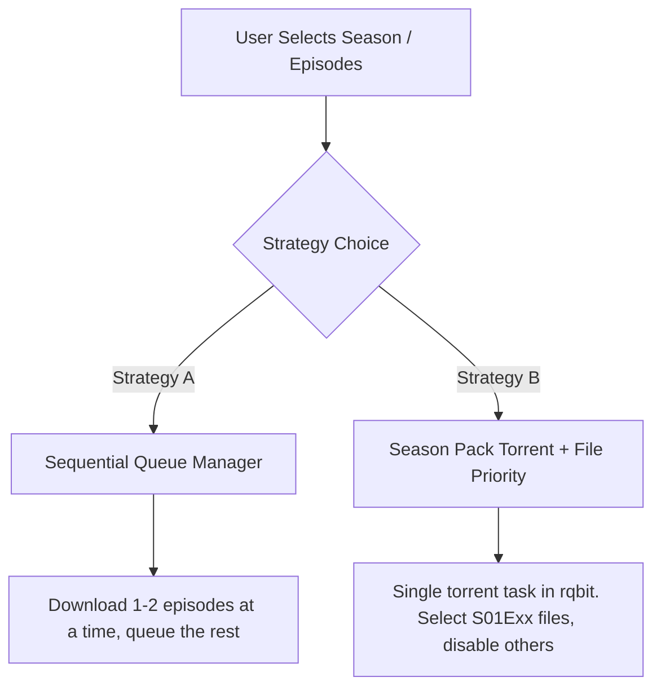

# StreamVault: TV Season & Episode P2P Download Specification

This document details the engineering design and implementation plan for adding fully controlled, reliable TV Series season and episode downloads inside **StreamVault**. It is designed to be read and executed by development agents (e.g. Claude) in future sessions.

---

## 1. The Core Problem: Current Limitations
Currently, StreamVault handles TV series downloads by triggering parallel individual episode torrents:
1. **Parallel Engine Overhead**: Clicking "Download Season" triggers `downloadEpisode` for every episode concurrently. This spawns 10 to 24 separate `rqbit` torrent tasks in parallel.
2. **Network/CPU Stalls**: Parallel DHT lookups, peer handshakes, and disk I/O for 20+ torrents degrade local disk bandwidth, causing `rqbit` crashes, UI freezes, or stuck `0.00%` progress states.
3. **Registry Desync**: With 24 individual tasks, state reconciliation messages over the Tauri bridge cause substantial UI lag and potential db lock contention in `p2p_registry.json`.

---

## 2. Recommended Architectural Solutions

We propose two complementary strategies to make TV season downloads 100% bug-free and highly performant:



### Strategy A: Sequential Download Queueing (Easy / Highly Reliable)
Instead of running all queued episodes concurrently, we introduce a **Download Queue Manager** in the frontend:
* **Max Concurrency**: Constrain the download engine to run a maximum of **1 or 2 active downloads** at any time.
* **Queue States**: Task statuses will distinguish between `'downloading'`, `'queued'` (waiting in line), `'paused'`, `'error'`, and `'completed'`.
* **State Transition**: When an active task completes (changes to `'completed'`), the manager automatically fetches the next `'queued'` task and triggers its engine startup.
* **Benefits**: 100% stable, keeps `rqbit` resource usage minimal, maximizes download speeds on a single file.

---

### Strategy B: Season Pack Torrents with File Selection (Advanced / Highly Efficient)
Instead of fetching 10-24 separate single-episode torrents, fetch **one single Season Pack torrent** (supported by Torrentio):
* **Single Task**: `rqbit` manages just one torrent task (e.g., `Game.of.Thrones.S01.COMPLETE.1080p`).
* **File Priority API**: `rqbit` supports selecting which files inside a torrent to download. We can set individual file priorities via the HTTP API:
  * **GET** `/torrents/{info_hash}/files` — Returns list of files with their indices, names, and sizes.
  * **POST** `/torrents/{info_hash}/files/{file_index}/priority` with body `{"priority": 0}` (skip) or `{"priority": 1}` (download).
* **Benefits**: Ultra-efficient (uses a single swarm/connections set), saves massive bandwidth, lets users toggle individual episodes on/off on the fly.

---

## 3. Detailed Technical Design & Implementation Steps

### Step 1: Sequential Queue Manager (Frontend)
Refactor `src/lib/downloads/manager.ts` and the Zustand store `src/store/downloads.ts`:
1. **State Addition**: Add an active task counter or limit (e.g., `const MAX_CONCURRENT = 1`).
2. **Reconciliation Loop Upgrade**: 
   * In `reconcileTorrentStates()`, track how many tasks are currently in the `'downloading'` state.
   * If `activeCount < MAX_CONCURRENT`, find the next task in the queue with `'queued'` status.
   * Transition that task to `'downloading'` and call the Tauri command `start_p2p_download` for it.
3. **Queue Controls**: Add "Move Up in Queue" or "Pause" controls to the downloads page.

---

### Step 2: Season Pack Support & File Selection
When Torrentio returns a season pack stream, the application must handle it as a multi-file stream:
1. **Registry Mapping**:
   * Map the season pack `infoHash` to multiple TMDB episode keys (`{showId}:s{season}e{episode}`) in a path map inside the app data directory.
2. **Regex File Matcher**:
   * Create a helper function in `src/lib/downloads/utils.ts` to map files in a torrent to TMDB episode numbers using regex patterns:
     ```typescript
     export const matchFileToEpisode = (fileName: string, seasonNum: number, episodeNum: number): boolean => {
         const cleanName = fileName.toLowerCase();
         // Matches patterns like "S01E05", "S1E5", "1x05", "1x5", or just episode number surrounded by word boundaries if season matches
         const sPattern = new RegExp(`s0?${seasonNum}e0?${episodeNum}\\b`, 'i');
         const xPattern = new RegExp(`\\b${seasonNum}x0?${episodeNum}\\b`, 'i');
         return sPattern.test(cleanName) || xPattern.test(cleanName);
     };
     ```
3. **Setting rqbit File Priorities**:
   * When starting a Season Pack download, fetch the file list via `GET /torrents/{info_hash}/files`.
   * For each file:
     * If it matches one of the user's selected episodes, call `POST /torrents/{info_hash}/files/{index}/priority` with `{"priority": 1}`.
     * Otherwise, call it with `{"priority": 0}`.
   * This guarantees that only the requested episodes are downloaded, saving GBs of bandwidth!

---

## 4. Summary of Developer Action Items
When implementing these features in future sessions:
- [ ] **Create a local queue manager** in `src/lib/downloads/manager.ts` that enforces `MAX_CONCURRENT = 2` for all downloading tasks.
- [ ] **Extend `EpisodeList.tsx`** to allow selecting multiple episodes and batching them through the queue manager (avoiding parallel swarms).
- [ ] **Utilize rqbit's `/files` and `/priority` API endpoints** to manage file-level selection inside multi-file season torrents.
- [ ] **Add strict error handling and logs** during torrent completion to accurately map and persist target video file paths in `episodeLibrary`.
